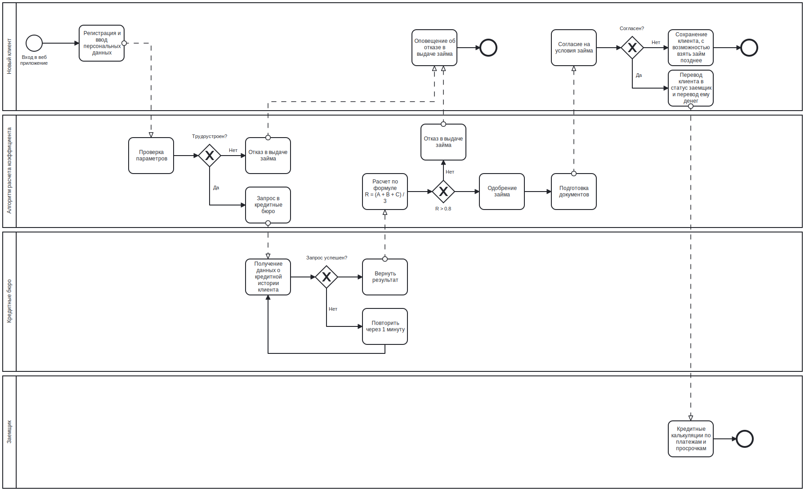

# Пример кода для собеседования в компанию PashaPay

## Проблема
Человек не может стабильно и объективно принимать решения о выдаче займа клиентам

## Цель
Автоматизировать принятие решения о выдаче займа

## Требования (максимально упрощены)
Решение о выдаче должно основываться на рейтинге заемщика, расчитываемому по формуле:   
R = (A + B + C) / 3       
Где:   
R - рейтинг заемщика   
A - коэффициент занятости, 0 - безработный/студент, 0.5 - самозанятый/бизнесмен, 1 - наемный работник    
B - коэффициент семейного положения, 0 - холост, 1 - женат/замужем    
C - коэффициент кредитной истории, 0 - есть непогашенные займы, 0.5 - все займы погашены, но с просроченными платежами, 1 - все займы погашены или займов не было

## Диаграмма бизнес процесса (максимально упрощена)

## Сценарии тестирования (максимально упрощены)

Сценарий: Должны отказать в займе берзаботному, без запроса в кредитное бюро    
Дано Я ввел данные безработного, женатого клиента, без истории займов  
Если Я делаю запрос на выдачу займа  
То Запрос в кредитные бюро НЕ проходит  
И Я вижу отказ в выдаче займа  

Сценарий: Должны одобрить займ для трудоустроенного, женатого клиента, без истории займов      
Дано Я ввел данные трудоустроенного, женатого клиента, без истории займов  
Если Я делаю запрос на выдачу займа  
То Запрос в кредитные бюро проходит  
И Я вижу одобрение займа  
  
Дано Я ввел данные трудоустроенного, холостого клиента, без истории займов  
Если Я делаю запрос на выдачу займа  
То Запрос в кредитные бюро проходит  
И Я вижу одобрение займа  

Дано Я ввел данные трудоустроенного, холостого клиента, с просроченными платежами в истории займов 
Если Я делаю запрос на выдачу займа  
То Запрос в кредитные бюро проходит  
И Я вижу отказ в выдаче займа
